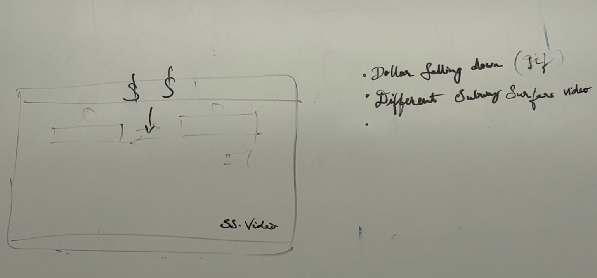

## Emoji Generator Plan

- There are a lot of free API, Gemini etc.
    - Can add whatever context we want (i.e. “translate in genz slang,” “explain like i’m 5”, etc.) in the prompt that we send over to gemini API
- Add key rotation, fault-tolerant
- Weird UI for fun
    - “Ooh ooh ah ah” sound effect when translation occurs
    - Dollar signs falling down the screen
    - Sizing is relative, not hard-coded
- Subway surfers/minecraft parkour for background
- Contribution, Requirement, Readme
- Add CI/CD - host on github pages (GitHub secrets with all the API keys; Also have some basic CI/CD for deploying)
- Container style - chat style similar to the Google translator
- Enter all text before hitting translate button instead of instantaneous piecewise translation
- Code review every PR - ()

# UI Frontend Design

- want to have two boxes
- button to switch between the two text boxes
- button to submit